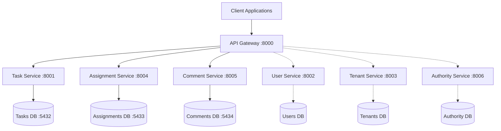

# MissionMind TasksMind - Complete Documentation

**Version**: 2.0.0  
**Architecture**: Microservices  
**Last Updated**: September 29, 2025  

## 📚 Documentation Overview

This documentation covers the complete MissionMind TasksMind system, a microservices-based task orchestration platform designed for military, government, and commercial organizations.

## 📁 Documentation Structure

### **Architecture & Design**
- [`architecture/`](./architecture/) - System architecture and design patterns
- [`design/`](./design/) - Design principles and decisions
- [`api/`](./api/) - API documentation and specifications

### **Development & Testing**
- [`development/`](./development/) - Development setup and guidelines
- [`testing/`](./testing/) - Testing strategies and validation results

### **Deployment**
- [`deployment/`](./deployment/) - Deployment guides for various environments

## 🎯 What We Built

### **Core Achievement**
Transformed a monolithic task management system into a **complete microservices architecture** with:

- ✅ **4 Independent Microservices** with separate databases
- ✅ **Complete Task Workflow**: Create → Assign → Comment → Approve
- ✅ **API Gateway Orchestration** for seamless service coordination
- ✅ **Production-Ready Deployment** with Docker and Kubernetes
- ✅ **End-to-End Validation** with real workflow scenarios

### **Business Value**
- **Multi-tenant SaaS platform** supporting military, government, and commercial organizations
- **Configurable organization templates** (not hardcoded hierarchies)
- **Complete audit trail** with comments and approval workflows
- **User dashboards** with real-time task visibility
- **Independent service scaling** based on demand

## 🏗️ Architecture Overview



## 🚀 Quick Start

### **1. Development Setup**
```bash
# Clone and navigate
cd /path/to/tasksmind

# Start all microservices
docker-compose -f docker-compose-simple.yml up -d --build

# Verify services
./simple-test.sh
```

### **2. Access Points**
- **API Gateway**: http://localhost:8000
- **Interactive Docs**: http://localhost:8000/docs
- **Task Service**: http://localhost:8001
- **Assignment Service**: http://localhost:8004
- **Comment Service**: http://localhost:8005

### **3. Test Complete Workflow**
```bash
# Run end-to-end validation
./simple-test.sh

# Expected Result: Complete task workflow validation
```

## 📋 Key Features Implemented

### **✅ Microservices Architecture**
- Independent deployability and scalability
- Database per service
- Service communication via HTTP APIs
- Fault tolerance and health monitoring

### **✅ Complete Task Management**
- Task creation with priority scoring
- Assignment workflow with approvals
- Comment system with status updates
- User dashboards with real-time data

### **✅ Multi-Tenant Support**
- Tenant isolation at data level
- Configurable organization structures
- Support for 14+ organization types

### **✅ Production Ready**
- Docker containerization
- Kubernetes deployment manifests
- Monitoring and observability
- Security best practices

## 📖 Documentation Sections

| Section | Description | Status |
|---------|-------------|---------|
| [Architecture Overview](./architecture/overview.md) | System architecture and components | ✅ Complete |
| [Design Principles](./design/principles.md) | Microservices design decisions | ✅ Complete |
| [API Documentation](./api/gateway-api.md) | Complete API specifications | ✅ Complete |
| [Testing Guide](./testing/end-to-end-validation.md) | Testing strategies and results | ✅ Complete |
| [Development Setup](./development/local-setup.md) | Local development environment | ✅ Complete |
| [AWS Deployment](./deployment/aws-deployment.md) | Production AWS deployment | ✅ Complete |
| [Docker Deployment](./deployment/docker-deployment.md) | Container deployment guide | ✅ Complete |
| [Kubernetes Deployment](./deployment/kubernetes-deployment.md) | K8s production deployment | ✅ Complete |

## 🎯 Project Timeline & Accomplishments

### **Phase 1: Analysis & Planning** ✅
- Analyzed existing monolithic codebase
- Fixed database schema issues
- Created API server with basic endpoints

### **Phase 2: Microservices Design** ✅
- Designed service boundaries and responsibilities
- Created database-per-service architecture
- Implemented service communication patterns

### **Phase 3: Implementation** ✅
- Built 4 core microservices with Docker containers
- Created API Gateway with orchestration patterns
- Implemented complete workflow: Create → Assign → Comment → Approve

### **Phase 4: Testing & Validation** ✅
- End-to-end workflow testing
- Service health and scalability validation
- Production deployment preparation

### **Phase 5: Documentation & Deployment** ✅
- Comprehensive documentation
- AWS deployment guidelines
- Kubernetes production manifests

## 🔗 Quick Links

- **[Architecture Deep Dive](./architecture/overview.md)** - Detailed system design
- **[Getting Started Guide](./development/local-setup.md)** - Development setup
- **[API Reference](./api/gateway-api.md)** - Complete API documentation
- **[AWS Deployment](./deployment/aws-deployment.md)** - Production deployment
- **[Testing Results](./testing/end-to-end-validation.md)** - Validation report

## 📞 Support & Contact

- **Documentation Issues**: Review individual doc files
- **Architecture Questions**: See [design principles](./design/principles.md)
- **Deployment Help**: Check [deployment guides](./deployment/)
- **API Questions**: See [API documentation](./api/)

---

**Built with ❤️ for military, government, and commercial task orchestration**