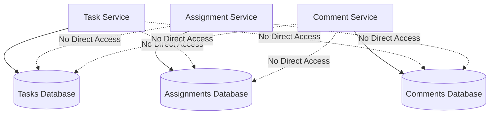

# Design Principles - MissionMind TasksMind

**Design Philosophy**: Domain-Driven Design + Microservices + SOLID Principles  
**Architecture Pattern**: Service-Oriented Architecture with Event-Driven Communication

## 🎯 Core Design Principles

### **1. Single Responsibility Principle (SRP)**
Each microservice has one clear business responsibility:

#### **✅ Task Service**
- **Single Responsibility**: Task lifecycle management
- **What it does**: Create, update, prioritize, and track tasks
- **What it doesn't do**: User management, assignments, or communication
- **Bounded Context**: Task domain with priority scoring and routing

#### **✅ Assignment Service**
- **Single Responsibility**: Assignment workflow and approvals
- **What it does**: Assign tasks, manage approvals, handle routing
- **What it doesn't do**: Task creation or comment management
- **Bounded Context**: Assignment and approval workflows

#### **✅ Comment Service**
- **Single Responsibility**: Communication and activity tracking
- **What it does**: Manage comments, status updates, and audit trails
- **What it doesn't do**: Task management or user authentication
- **Bounded Context**: Communication and activity logging

#### **✅ API Gateway**
- **Single Responsibility**: Request orchestration and service coordination
- **What it does**: Route requests, aggregate responses, handle cross-cutting concerns
- **What it doesn't do**: Business logic or data storage
- **Bounded Context**: Service orchestration and client interface

### **2. Database Per Service**
Each service owns its data completely to ensure independence:



**Benefits**:
- **Data Isolation**: No shared database dependencies
- **Independent Scaling**: Scale database per service needs
- **Technology Diversity**: Each service can use optimal storage
- **Fault Isolation**: Database issues don't cascade across services

### **3. API-First Design**
All service communication happens through well-defined APIs:

#### **Service-to-Service Communication**:
```python
# Assignment Service calling Task Service
async def update_task_assignment(task_id: str, assigned_to: str):
    async with httpx.AsyncClient() as client:
        response = await client.put(
            f"{TASK_SERVICE_URL}/tasks/{task_id}",
            json={"assigned_to": assigned_to, "status": "assigned"}
        )
        return response.json()
```

#### **API Contract Design**:
- **Versioned APIs**: `/api/v2/` for backward compatibility
- **RESTful Design**: Standard HTTP methods and status codes
- **Consistent Response Format**: Standardized error and success responses
- **OpenAPI Specification**: Auto-generated documentation

### **4. Stateless Service Design**
All services are stateless to enable horizontal scaling:

#### **✅ Stateless Implementation**:
```python
# No global state or instance variables
class TaskService:
    def create_task(self, task_data: TaskCreate, session: Session):
        # All state comes from parameters
        task = Task(**task_data.model_dump())
        session.add(task)
        session.commit()
        return task  # No service state modified
```

**Benefits**:
- **Horizontal Scaling**: Any instance can handle any request
- **Load Distribution**: No session affinity required
- **Fault Tolerance**: Instance failures don't lose state
- **Deployment Flexibility**: Rolling updates without state migration

### **5. Domain-Driven Design (DDD)**
Service boundaries align with business domains:

#### **Domain Boundaries**:
```
┌─────────────────────┐    ┌─────────────────────┐    ┌─────────────────────┐
│   TASK DOMAIN       │    │  ASSIGNMENT DOMAIN  │    │  COMMUNICATION      │
│                     │    │                     │    │     DOMAIN          │
│ • Task Lifecycle    │    │ • Assignment Flow   │    │ • Comments          │
│ • Priority Scoring  │    │ • Approval Process  │    │ • Status Updates    │
│ • Routing Rules     │    │ • Authority Checks  │    │ • Activity Log      │
│ • Due Date Mgmt     │    │ • Task Routing      │    │ • Notifications     │
└─────────────────────┘    └─────────────────────┘    └─────────────────────┘
```

### **6. Event-Driven Architecture**
Services communicate through events to maintain loose coupling:

#### **Event Flow Example**:
```python
# Task creation triggers cascade of events
async def create_task_workflow(task_data: TaskCreate):
    # 1. Create task
    task = await create_task(task_data)
    
    # 2. If assigned, create assignment (event)
    if task_data.assigned_to:
        assignment = await create_assignment({
            "task_id": task.id,
            "assigned_to": task_data.assigned_to
        })
        
        # 3. Update task status (event)
        await update_task_status(task.id, "assigned")
        
        # 4. Create notification comment (event)
        await create_comment({
            "task_id": task.id,
            "content": f"Task assigned to {task_data.assigned_to}",
            "type": "status_update"
        })
```

### **7. Circuit Breaker Pattern**
Implement fault tolerance for service-to-service communication:

```python
async def call_service_with_circuit_breaker(service_url: str, endpoint: str):
    try:
        response = await httpx.get(f"{service_url}{endpoint}", timeout=30.0)
        return response
    except httpx.RequestError:
        # Circuit breaker logic - fail fast for subsequent requests
        logger.warning(f"Service {service_url} unavailable - circuit breaker activated")
        # Return degraded response or cached data
        return {"status": "service_unavailable", "cached": True}
```

### **8. Multi-Tenant Architecture**
Design for multi-tenancy from the ground up:

#### **Tenant Isolation Strategy**:
```sql
-- Every table includes tenant_id for row-level security
CREATE TABLE task (
    id VARCHAR PRIMARY KEY,
    tenant_id VARCHAR NOT NULL,  -- Mandatory for all tables
    title VARCHAR NOT NULL,
    -- ... other fields
    CONSTRAINT fk_task_tenant FOREIGN KEY (tenant_id) REFERENCES tenant(id)
);

-- All queries filter by tenant
SELECT * FROM task WHERE tenant_id = 'acme-corp' AND status = 'pending';
```

#### **Tenant Context Propagation**:
```python
class TenantContextBase(BaseModel):
    tenant_id: str = Field(..., description="Tenant ID for multi-tenancy")

class TaskCreate(TenantContextBase):
    title: str
    description: Optional[str] = None
    # tenant_id automatically included
```

### **9. Security by Design**
Security considerations built into architecture:

#### **Defense in Depth**:
```
┌─────────────────────┐
│   API Gateway       │ ← Authentication, Rate Limiting, Input Validation
├─────────────────────┤
│  Service Layer      │ ← Authorization, Business Logic Validation
├─────────────────────┤
│  Data Layer         │ ← Tenant Isolation, Encryption at Rest
└─────────────────────┘
```

#### **Security Implementation**:
- **Authentication**: JWT tokens at API Gateway
- **Authorization**: Role-based access control per tenant
- **Data Isolation**: Tenant-based row-level security
- **Network Security**: Services in private subnets
- **Audit Logging**: All actions tracked with user context

### **10. Observability by Design**
Built-in monitoring and observability:

#### **Observability Stack**:
```python
# Health check endpoints in every service
@app.get("/health")
def health_check():
    return {
        "status": "healthy",
        "service": "task-service",
        "timestamp": datetime.utcnow(),
        "version": "1.0.0"
    }

# Metrics endpoints for Prometheus
@app.get("/metrics")
def get_metrics():
    return {
        "service": "task-service",
        "requests_total": request_counter,
        "response_time_avg": response_time_avg,
        "database_connections": db_pool_size
    }
```

#### **Structured Logging**:
```python
import logging
import json

logger = logging.getLogger(__name__)

def log_task_created(task_id: str, tenant_id: str, user_id: str):
    logger.info(json.dumps({
        "event": "task_created",
        "task_id": task_id,
        "tenant_id": tenant_id,
        "user_id": user_id,
        "timestamp": datetime.utcnow().isoformat(),
        "service": "task-service"
    }))
```

## 🏗️ Architectural Patterns Used

### **1. API Gateway Pattern**
- **Purpose**: Single entry point for all client requests
- **Benefits**: Cross-cutting concerns, request aggregation, service discovery
- **Implementation**: FastAPI with httpx for service calls

### **2. Database Per Service Pattern**
- **Purpose**: Data independence and service autonomy
- **Benefits**: Independent scaling, technology diversity, fault isolation
- **Implementation**: Separate PostgreSQL databases per service

### **3. Saga Pattern**
- **Purpose**: Distributed transaction management
- **Benefits**: Eventual consistency, compensating actions
- **Implementation**: Orchestration via API Gateway

### **4. CQRS (Command Query Responsibility Segregation)**
- **Purpose**: Separate read and write models
- **Benefits**: Optimized queries, scalable reads
- **Implementation**: Future enhancement with read replicas

### **5. Event Sourcing**
- **Purpose**: Complete audit trail and event replay
- **Benefits**: Full history, debugging, analytics
- **Implementation**: Future enhancement with event store

## 🎯 Design Decisions Made

### **Technology Choices**

#### **Framework: FastAPI**
- **Why**: High performance, automatic OpenAPI docs, async support
- **Alternative Considered**: Django REST Framework, Flask
- **Decision Factors**: Type hints, performance, modern Python features

#### **Database: PostgreSQL**
- **Why**: ACID compliance, JSON support, mature ecosystem
- **Alternative Considered**: MongoDB, MySQL
- **Decision Factors**: Reliability, SQL features, multi-tenant support

#### **Container: Docker**
- **Why**: Consistency across environments, easy deployment
- **Alternative Considered**: Native deployment, VM-based
- **Decision Factors**: Portability, resource efficiency, ecosystem

#### **Orchestration: Kubernetes**
- **Why**: Industry standard, auto-scaling, service discovery
- **Alternative Considered**: Docker Swarm, ECS
- **Decision Factors**: Feature richness, ecosystem, production readiness

### **Service Boundaries**

#### **Why Separate Task and Assignment Services?**
- **Domain Separation**: Task creation vs. assignment workflow are different domains
- **Scaling Needs**: Assignment service handles more complex approval workflows
- **Team Organization**: Different teams can own different services
- **Future Evolution**: Assignment service can add complex approval matrices

#### **Why Separate Comment Service?**
- **Communication Domain**: Comments represent communication, not task management
- **Volume Characteristics**: Comments may have different scaling patterns
- **Feature Evolution**: Future features like file attachments, notifications
- **Audit Requirements**: Separate service for compliance and audit trails

### **Data Consistency Approach**

#### **Eventual Consistency Choice**
- **Why**: Better availability and partition tolerance (CAP theorem)
- **Trade-off**: Immediate consistency sacrificed for scalability
- **Mitigation**: Compensating actions and reconciliation processes
- **Monitoring**: Consistency checks and alerting for data drift

## 🚀 Evolution and Extensibility

### **Service Addition Strategy**
New services can be added following the same patterns:

1. **Identify Domain Boundary**: Clear business responsibility
2. **Design API Contract**: RESTful interface with OpenAPI spec
3. **Implement Database Schema**: Independent data model
4. **Add Health/Metrics Endpoints**: Observability from day one
5. **Update API Gateway**: Add routing and orchestration logic
6. **Document and Test**: Comprehensive documentation and testing

### **Migration Strategy**
For existing monolithic features:

1. **Extract Service**: Identify and extract service code
2. **Create Database**: Migrate data to new service database  
3. **Update API Gateway**: Add routing for new service
4. **Deprecate Old Endpoints**: Gradual migration of clients
5. **Remove Monolith Code**: Clean up after migration complete

---

These design principles ensure that MissionMind TasksMind is scalable, maintainable, and evolvable while meeting the demanding requirements of military, government, and commercial task orchestration.